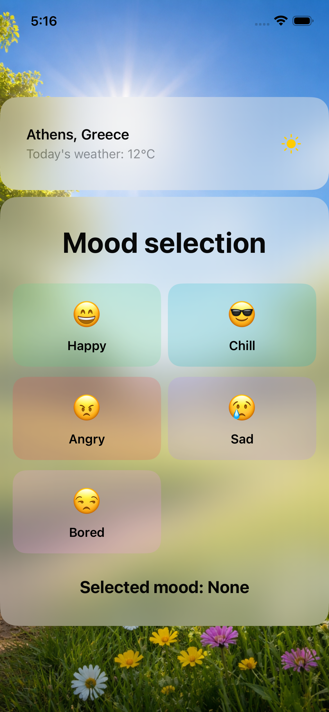
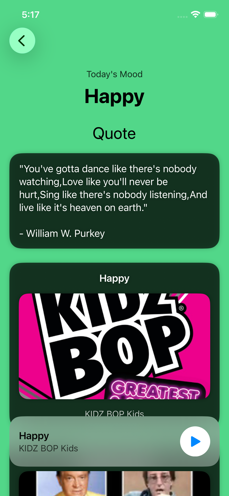
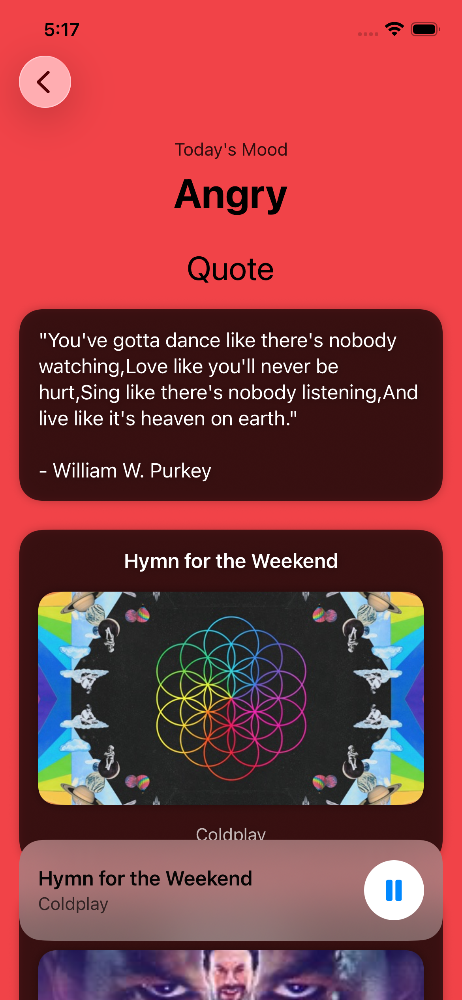

MoodChill 🎧🌤️

MoodChill is a SwiftUI iOS app that recommends music, quotes, and TV shows based on the user’s current mood.

The app also integrates weather data to create a more dynamic and personalized experience.

✨ Features
🎭 Mood-based recommendations (Happy, Chill, Angry, Sad, Bored)
🎵 Music suggestions with preview playback
💬 Inspirational quotes
🎬 TV show recommendations
🌤️ Weather integration
🎨 Dynamic background based on weather conditions
⚡ Built with SwiftUI and MVVM architecture

🛠 Tech Stack
Swift
SwiftUI
MVVM Architecture
Async/Await
URLSession
AVPlayer

🧱 Architecture
The app follows the MVVM pattern:

Views: UI components built with SwiftUI
ViewModels: business logic and state management
Models: data structures for API responses
Networking: API handling through NetworkClient

🌐 APIs Used
API Ninjas Quotes API
iTunes Search API
TVMaze API
Weather API

⚙️ Setup
To run this project, you need to add your API key in the Info.plist:

Key: API_KEY
Value: your API key

🚀 Future Improvements
Location-based weather
Night mode backgrounds
Favorites system
More UI polish and animations

📸 Screenshots

